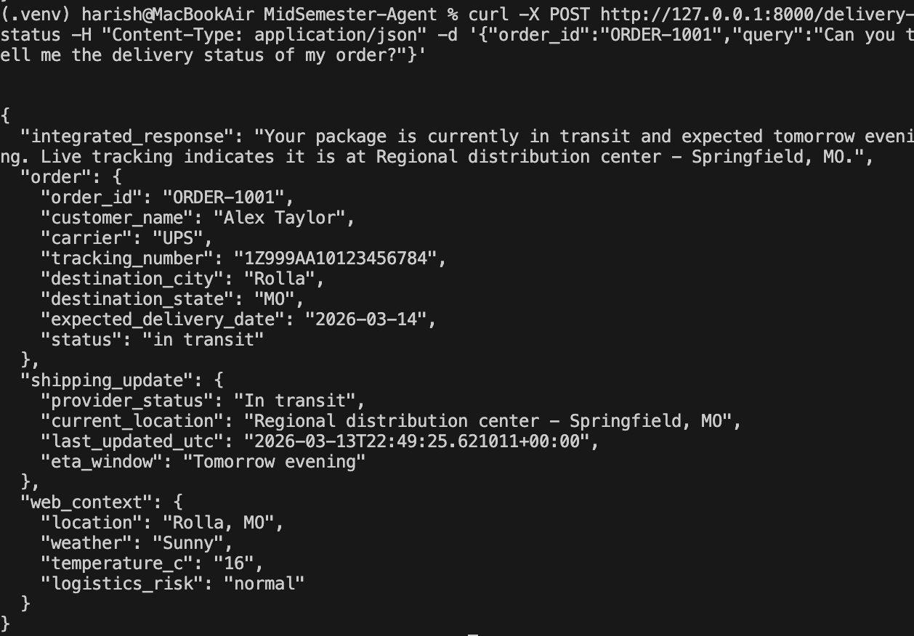
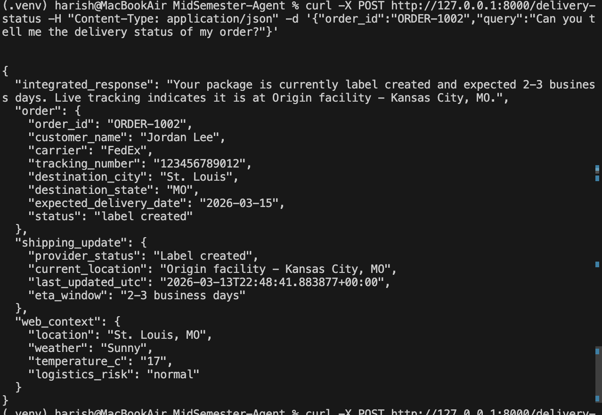

# Single-Agent Customer Support Assistant

This is a single agent workflow that tells the delivery status of the order. There are four features integrated in this assistant which are query submission and evaluation, knowledge source selection, data integration and LLM synthesis and finally the output generation.

The Assistant used llama3: latest model.

## In order to run the agent, follow these steps:

```bash
python -m pip install -r requirements.txt
```

```bash
./run_agent.sh
```

```bash
curl -X POST http://localhost:8000/delivery-status \
  -H "Content-Type: application/json" \
  -d '{
    "order_id": "ORDER-1001",
    "query": "Can you tell me the delivery status of my order?"
  }'
```

## Couple of Outputs Running the Customer Support Assistant



